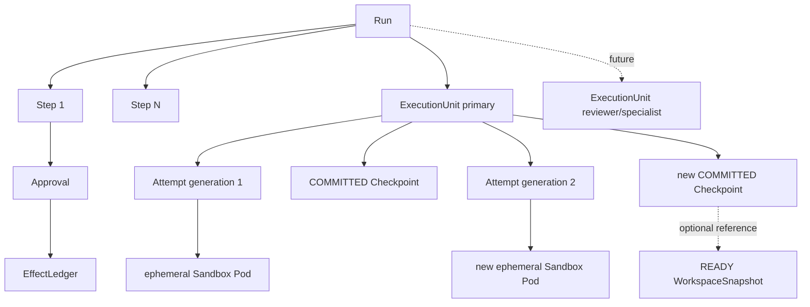
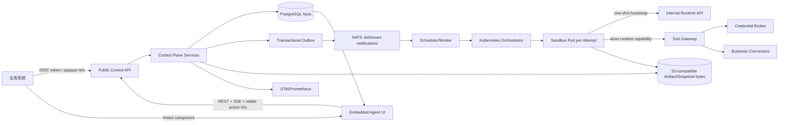

# 企业 Agent 平台总体架构

## 1. 目标与边界

本工程是一套可整体复制、独立构建、独立部署的企业 Agent 平台。它解决的不是"如何调用一次模型"，而是如何把长时间、可中断、可能产生外部副作用的 Agent 工作，放进一个多租户、可审批、可恢复、可审计的分布式执行系统。

平台代码不导入宿主业务系统。业务系统通过明确的 Host Ports 提供身份、资源解析、策略和业务连接器；平台通过稳定 HTTP、事件、Artifact 与前端 SDK 返回状态和结果。把整个目录复制到新的仓库后，核心包、Contracts、前端 SDK、部署资产和验证脚本仍然具有完整含义。

当前版本有以下明确边界：

- 第一版按单 Agent 编排：一个 Run 在任一时刻最多有一个活跃执行单元。
- 单 Agent 是当前 admission、scheduler 和并发策略，不是持久化模型的一对一约束。
- `reference/local_stack.py` 只是显式启用的 API-only、进程内、create-only 演示。它能创建并查询 QUEUED Run，但没有 durable worker，不能把该 Run 执行到完成，也不是生产 fallback。
- 生产进程必须注入认证、资源、策略、持久化、调度、worker、对象存储和连接器适配：平台不会在缺少配置时退回"内置管理员"。

## 2. 统一执行模型

### 2.1 稳定业务实体

| 实体 | 含义 | 生命周期与持久化原则 |
| --- | --- | --- |
| Run | 用户发起的一次业务任务及其整体生命周期 | 是用户可查询、取消、重跑和审计的根实体；不绑定浏览器 Session、Runner 或 Pod |
| Step | Run 内可持久化、可审批、可恢复的业务步骤 | 保存步骤状态、策略快照和失败原因；一个 Run 可以有多个 Step |
| ExecutionUnit | 编排器可独立调度的 Agent 执行单元 | 当前每个 Run 创建一个 primary 单元；未来可在同一 Run 下增加 planner、analyst、reviewer 等单元 |
| Attempt | 某个执行单元针对某一步或任务的一次具体执行 | 每次重试、Lease 丢失或恢复都产生新 Attempt 和更高 generation；历史 Attempt 不被覆盖 |
| Checkpoint | 可恢复的业务游标和已验证引用集合 | COMMITTED 后成为 ExecutionUnit 的恢复游标，是 PostgreSQL 事实；不等于 Pod 文件目录 |
| WorkspaceSnapshot | 某个 Attempt 工作区不可变字节快照 | 对象内容在对象存储，元数据、checksum、runtime image digest 和 READY 状态持久化；可选地被 Checkpoint 引用 |
| Approval | 对持久化 ActionProposal 的人工决定 | 审批对象、请求摘要、决定人、版本和审计事实都持久化；不依赖打开审批页面的前端 Session |
| EffectLedger | 已批准外部写操作的唯一执行账本 | 用稳定 effect_key 去重，记录 PREPARED/EXECUTING/UNKNOWN/SUCCEEDED/FAILED、executor_id、递增 execution_epoch 和执行租约；外部结果不确定时禁止盲目重试 |
| Artifact | Run 产生或消费的受控结果 | 元数据与 lineage 持久化，字节在对象存储；浏览器通过短期授权下载 |
| RunEvent | Run 内按 event_seq 严格递增的业务事件 | 用于重放、投影和 UI 增量更新；NATS 通知丢失不影响事件事实 |

Agent Runtime/Runner 是真正运行 Agent 逻辑的进程或程序；Sandbox Pod 是承载一次 Attempt 的临时隔离环境。它们都不是业务事实源。Pod 可以销毁并由新 Pod 承载新 Attempt，Runner 进程也可以升级或迁移，而 Run、Step、Checkpoint、审批、Artifact 和事件仍然存在。

### 2.2 关系而不是永久一对一

数据库约束和 generation fence 保证同一 ExecutionUnit 不会同时接受两个活跃 Attempt 的写入。未来多 Agent 仍使用同一套结构：一个 Run 下增加多个 ExecutionUnit，每个单元拥有自己的 Attempt、Lease、Checkpoint、Sandbox Pod、权限范围和恢复状态。

## 3. 分层架构

### 3.1 Public Control Plane

公共 API 负责：

- 认证用户并从可信 Host Port 得到 tenant_id、actor_id 和 scopes；
- 把 opaque resource_ref 解析为 canonical resource facts；
- 固化 Run 创建时的策略版本、scope、budget 和摘要；
- 创建、查询、取消、重跑 Run；
- 提供事件分页、SSE 和持久化 RunView；
- 接收与不可变 Surface revision 绑定的 UI Action；
- 生成 Artifact 短期下载授权。

公共请求不能通过 `X-Tenant-Id` 自报租户，也不能提交连接器地址、对象存储 key、Pod 地址、凭据或任意回调 URL。

### 3.2 Durable Control Services

独立运维应用组装的公开 composition services/ports，不要求调用方导入内部数据库表。ControlPlaneService、Checkpoint/恢复函数、ApprovalDecisionService、DurableEffectExecutor、Surface/Artifact 服务围绕稳定记录工作。重要写入使用 PostgreSQL 事务、CAS version、幂等键、Audit 与 Outbox。ApprovalDecisionService 和 DurableEffectExecutor 是可由宿主显式组合的公开服务。

### 3.3 Scheduler、Orchestrator 与 Runtime

Scheduler 从 PostgreSQL 查询可调度工作，按 tenant round-robin 做 admission，并通过持久化约束领取一个 Attempt/Lease。Orchestrator 把 Attempt 转成 Kubernetes Job：Job 只承载这一次 Attempt，backoffLimit=0，重试由控制面新建 Attempt，而不是让 Kubernetes 在同一业务执行记录内静默重试。

Runtime 执行 Checkpoint 恢复、心跳续 Lease，通过内部 Runtime API 请求 READ tool、Artifact、ActionProposal、Checkpoint 或 failure 操作。

### 3.4 Tool Gateway 与 Effect Executor

WRITE tool 不在 Runtime 内直接执行。Runtime 只能持久化 ActionProposal 并暂停等待审批：批准后生成 EffectLedger，再由独立 Effect Executor 通过 tenant-bound、effect-bound capability 执行。`/internal/v1/tenants/{tenant_id}/effects/{effect_id}/execute` 先验证 effect-worker service identity，再把实际 worker subject 作为 executor_id 传给 Executor。领取事务持久化该 owner、新的 execution_epoch 和以数据库时间计算的租约截止点；Connector finish 与 watchdog 之后都必须命中相同 owner/epoch 对，Audit 也记录实际 subject 和 epoch。这不是仅供观测的标签，而是防止失效 worker 收尾或 watchdog 覆盖新 ownership 的持久化 fence。该 internal route 不是浏览器或普通业务客户端 API。

### 3.5 A2UI 与嵌入式前端

Runtime 或控制面交的是声明式 Surface 文档，不是 JavaScript、HTML 或组件模块。服务端只接受固定 catalog，持久化不可变 revision；浏览器 SDK 再次校验协议并只渲染 allowlisted React 组件。用户动作只携带 Run、Surface、revision、action_ref、客户端幂等 ID 和显示摘要，服务端从已持久化 Surface 反查 approval_id、canonical target 和 request digest。

## 4. 三条不可混淆的数据路径

| 路径 | 用途 | 丢失后的含义 |
| --- | --- | --- |
| PostgreSQL 领域事实 | Run、Step、ExecutionUnit、Attempt、Lease、Checkpoint、审批、Effect、Artifact 元数据、事件、Outbox/Inbox、Audit | 不允许无恢复策略地丢失：这是裁决和恢复的唯一事实源 |
| NATS JetStream | 运输"有新工作/新事件"的通知 | 可以从 PostgreSQL Outbox 补发；消费者由 Inbox 去重；不能据此重建业务真相 |
| OTel/Prometheus | trace、metric、告警和容量诊断 | 允许采样或短时丢失；不能替代 Audit、EffectLedger 或 Checkpoint |
| S3-compatible object store | 保存 Artifact 和 WorkspaceSnapshot 的不可变字节 | 其 READY 元数据、版本、checksum 和 lineage 仍由 PostgreSQL 裁决。对象存在但数据库未提交 READY，不能作为可恢复输入；数据库引用的对象 checksum 不匹配则是正确性事故 |

## 5. 端到端状态与数据流

### 5.1 创建 Run

1. 浏览器或业务后端向 `POST /v1/runs` 发送 workflow_type、intent、opaque resource refs、业务参数和可选 host context ref。
2. AuthPort 从 token 派生租户、用户和 scopes；Resource/Context/Policy Ports 在超时和 fail-closed 边界内解析权威事实。
3. ControlPlane 在一个事务内写入 Run、当前单个 primary ExecutionUnit、初始 COMMITTED Checkpoint、RunEvent、Outbox、幂等结果以及有授权快照时的 Audit。
4. 返回 201、Location、ETag 和 RunViewSnapshot，此时 QUEUED 只表示持久化成功，不表示已有 Runner 或 Pod。

### 5.2 调度和启动 Attempt

1. Outbox 通知 scheduler 有工作，但 scheduler 仍从 PostgreSQL 读取事实。
2. Scheduler 领取工作时创建新 Attempt 与 RESERVED Lease，并递增 ExecutionUnit generation。
3. Orchestrator 创建一个 digest-pinned Kubernetes Job；控制面记录 Pod 与 Attempt binding。
4. Pod 使用 projected token 和 downward API Pod UID 做一次 bootstrap：Control Plane TokenReview 验证 audience、namespace、ServiceAccount、Pod UID、Attempt 和 generation。

### 5.3 Checkpoint 与普通继续执行

Runtime 先把 Artifact/WorkspaceSnapshot 字节写到对象存储并完成 READY 校验，再提交 Checkpoint metadata。Control Plane 检查 active Lease、owner、version、generation、来源 Checkpoint、READY Artifact/Snapshot、runtime image digest 和 checksum。随后在一个事务内：

- 插入新的 COMMITTED Checkpoint；
- 把 ExecutionUnit 的 current_checkpoint_id 推进到新 Checkpoint；
- 更新 Attempt/Run version；
- 追加事件、Audit 和 Outbox。

只有事务提交后的 Checkpoint 才能用于恢复。Pod 本地 `/workspace` 不是进度事实。

### 5.4 审批、外部 Effect 与恢复

1. Runtime 生成 canonical ActionProposal：request_digest 固化 action ref、Tool/version/spec digest、Connector、required scopes、canonical target、payload digest 与 risk class。随后提交包含恢复游标的 Checkpoint，并请求 approval pause。一个事务把 Checkpoint、Approval、Step/Unit/Run=WAITING_APPROVAL、Attempt=CHECKPOINTED_FOR_APPROVAL、Lease=RELEASED、事件、Audit 和 Outbox 一起持久化。
2. SurfaceBoundActionHandler 先校验 immutable Surface revision 与 action binding；ApprovalDecisionService 再校验 tenant、scope、Approval/ActionProposal binding、displayed digest、版本、过期时间和幂等键。
3. APPROVE：原子持久化 Approval=APPROVED、ActionProposal=CONSUMED 和唯一 PREPARED Effect。
4. REJECT：持久化拒绝、并让 Run/Unit 从已提交 Checkpoint 进入 RECOVERING，不创建 Effect。
5. Internal route 校验 effect-worker service identity，把验证后的 worker subject 作为 executor_id 传入 Effect Executor：Executor 再校验与持久化 Effect 完全一致的 tenant/effect/approval/request/tool/spec/connector/target/scopes-bound capability。领取时写入该 executor_id、递增的 execution_epoch 和执行租约，从 Broker 获取凭据，使用 effect_key 作为连接器幂等键执行。每个 Connector finish 只能用自己领取到的 owner/epoch 对收尾，并把该 subject/epoch 写入 Audit。
6. Effect 成功或拒绝恢复后，scheduler 从等待前的 COMMITTED Checkpoint 创建更高 generation 的新 Attempt、新 Lease 和新 Pod：原 Attempt 与原 Pod 不恢复为活跃状态。
7. Effect worker 失联时，watchdog 必须提交它所观测的 expected executor_id + execution_epoch，只有该对仍是当前 ownership 且持久化执行租约已按数据库时间到期，才能执行 EXECUTING→UNKNOWN；owner/epoch mismatch 或租约未到期都必须 fail closed，watchdog Audit 保留它裁决的 worker subject/epoch。迟到的 Connector 成功仍须命中原 owner/epoch，才可把 UNKNOWN 更新为 SUCCEEDED，保留已发生的外部事实。
8. 已知失败后，操作者通过 public failed-Effect recovery command 提交 If-Match、幂等键和 `effects:recover` 权限。该事务保留原 FAILED Effect 不变，把 Run/ExecutionUnit 转为 RECOVERING、Step 转为 ACTIVE，并从已提交 Checkpoint 调度新 Attempt：successor Agent 必须重新规划、创建新 ActionProposal 并获得新审批，不得重新 dispatch 旧 Effect。
9. 外部成功返回期间若 Run 被并发取消，Effect=SUCCEEDED 仍作为外部事实提交，Run 保持 CANCEL_REQUESTED：Pod/Run 状态不能反向覆盖外部结果。

### 5.5 失败、Lease 过期与重试

Runtime 明确失败、进程崩溃、Pod 丢失和 Lease 过期都不能覆盖原 Attempt。Lease recovery 使用 Inbox 去重，在同一事务中：

- 标记 Attempt=LOST、Lease=EXPIRED；
- 确认当前恢复源为 COMMITTED Checkpoint；
- 新建 generation+1 的 Attempt 与 RESERVED Lease；
- Run/ExecutionUnit 进入 RECOVERING；
- 写入事件、Audit、Outbox 与 Inbox processed marker；
- 撤销旧 capability、删除旧 Sandbox、调度 successor Attempt。

因此"恢复"意味着基于业务事实创建新 Attempt，不是复活原 Runner 进程。不能用 Pod 已删除或进程不可达替代 owner/epoch 匹配与 Effect 租约到期证据。

## 6. 当前单 Agent 与未来多 Agent

当前 admission 规则限制同一个 Run 同时只有一个活跃 ExecutionUnit，创建 Run 时只创建 role="primary" 的 ExecutionUnit，这一规则减少第一版审批、并发、资源配额和 UI 汇总复杂度。

扩展到多 Agent 时不修改 Run 的基本语义，而是：

1. 在一个 Run 下创建多个具备 role 和 dependency 的 ExecutionUnit；
2. 对每个 ExecutionUnit 独立维护 generation、Attempt、Lease、Checkpoint 和 capability；
3. Scheduler 根据依赖、tenant quota 和 Run budget 决定并发；
4. Artifact lineage 和事件 causation 连接多个单元的输入输出；
5. 审批绑定具体 Step/ActionProposal/ExecutionUnit，但仍汇总在稳定 Run 下；
6. Run terminal 状态由编排策略聚合，不由任意一个 Pod 决定。

数据库模型已经避免 Run、Runtime、Pod 永久一对一；多 Agent 的主要新增工作是依赖图、并发 admission、跨单元消息和聚合状态策略。

## 7. 高可用与资源调度

- PostgreSQL 通过事务、唯一约束、CAS、数据库时间和 fencing 保证正确性：生产 HA/PITR 由托管数据库或等价方案提供。
- API 可无状态多副本：SSE 客户端用持久化 cursor 重连。
- Outbox publisher、Inbox consumer 和 scheduler 可通过数据库互斥与幂等横向扩展：严格 tenant round-robin 需要单活 scheduler 或显式分布式选主。
- NATS consumer lag 可驱动 KEDA；API 延迟可驱动 HPA；ResourceQuota、PriorityClass 和每 Attempt CPU/内存/时限避免 Sandbox 抢占控制面。
- Artifact/Snapshot 使用版本化对象存储、retention 与 checksum：对象存储不可被当作数据库锁服务。

## 8. 可移植性约束

平台长期遵守以下规则：

- 核心包不导入宿主业务模块：宿主适配器位于平台目录之外，通过公开 Protocol 和 factory 注入。
- Contracts、OpenAPI、JSON Schema 和前端 runtime validators 版本化并可确定性生成。
- 配置只保存 endpoint/Secret 引用等契约，不提交真实凭据。
- 文档、测试、镜像构建上下文和脚本不依赖某台开发机的绝对路径。

## 9. 延伸阅读

- [security.md](security.md)：Sandbox、身份、网络、工具、A2UI 和剩余风险。
- [implementation.md](implementation.md)：当前代码模块、公开边界、部署和验证证据。
- [embedding-guide.md](embedding-guide.md)：如何由现有业务系统通过 Ports、HTTP 和前端 SDK 接入。
- [migration-guide.md](migration-guide.md)：从宿主内嵌原型迁移为独立平台的分阶段方案。
